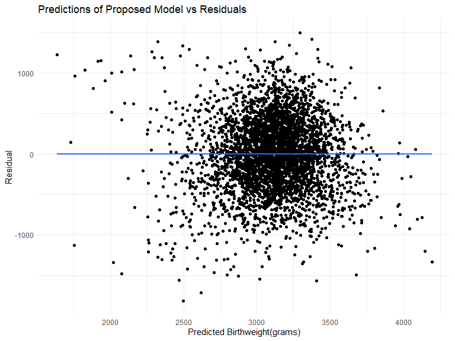
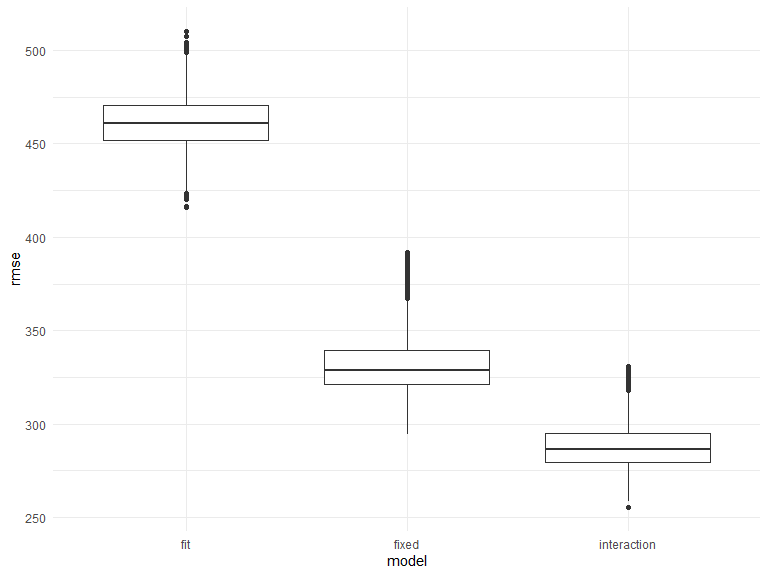
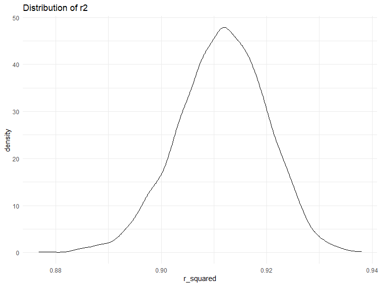
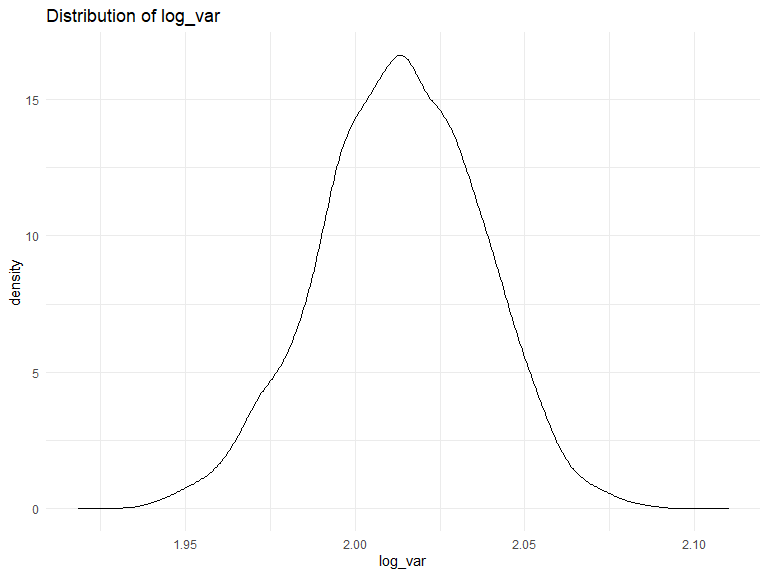

Homework 6
================
aw3253
12/4/2021

# Problem 1

Importing Data:

``` r
birth =
  read_csv(file = "./data/birthweight.csv") %>% 
  drop_na()
```

    ## Rows: 4342 Columns: 20

    ## -- Column specification --------------------------------------------------------
    ## Delimiter: ","
    ## dbl (20): babysex, bhead, blength, bwt, delwt, fincome, frace, gaweeks, malf...

    ## 
    ## i Use `spec()` to retrieve the full column specification for this data.
    ## i Specify the column types or set `show_col_types = FALSE` to quiet this message.

Data Cleaning:

``` r
birth_df =
birth %>% 
  mutate(babysex = factor(babysex,
                          levels = c(1, 2),
                          labels = c("Male", "Female"))) %>% 
  mutate(frace = factor(frace,
                        levels = c(1, 2, 3, 4, 8, 9),
                        labels = c("White", "Black", "Asian", "Puerto Rican", "Other", "Unknown"))) %>% 
  mutate(malform = factor(malform,
                          levels = c(0, 1),
                          labels = c("Absent", "Present"))) %>% 
  mutate(mrace = factor(mrace,
                        levels = c(1, 2, 3, 4, 8),
                        labels = c("White", "Black", "Asian", "Puerto Rican", "Other")))

birth_df
```

    ## # A tibble: 4,342 x 20
    ##    babysex bhead blength   bwt delwt fincome frace gaweeks malform menarche
    ##    <fct>   <dbl>   <dbl> <dbl> <dbl>   <dbl> <fct>   <dbl> <fct>      <dbl>
    ##  1 Female     34      51  3629   177      35 White    39.9 Absent        13
    ##  2 Male       34      48  3062   156      65 Black    25.9 Absent        14
    ##  3 Female     36      50  3345   148      85 White    39.9 Absent        12
    ##  4 Male       34      52  3062   157      55 White    40   Absent        14
    ##  5 Female     34      52  3374   156       5 White    41.6 Absent        13
    ##  6 Male       33      52  3374   129      55 White    40.7 Absent        12
    ##  7 Female     33      46  2523   126      96 Black    40.3 Absent        14
    ##  8 Female     33      49  2778   140       5 White    37.4 Absent        12
    ##  9 Male       36      52  3515   146      85 White    40.3 Absent        11
    ## 10 Male       33      50  3459   169      75 Black    40.7 Absent        12
    ## # ... with 4,332 more rows, and 10 more variables: mheight <dbl>, momage <dbl>,
    ## #   mrace <fct>, parity <dbl>, pnumlbw <dbl>, pnumsga <dbl>, ppbmi <dbl>,
    ## #   ppwt <dbl>, smoken <dbl>, wtgain <dbl>

Proposed Model for Birthweight:

``` r
fit= lm(bwt ~ gaweeks+ smoken + delwt + pnumlbw + wtgain + momage, data = birth_df)
fit %>% broom::tidy()
```

    ## # A tibble: 7 x 5
    ##   term        estimate std.error statistic    p.value
    ##   <chr>          <dbl>     <dbl>     <dbl>      <dbl>
    ## 1 (Intercept)  -203.      94.3       -2.16  3.11e-  2
    ## 2 gaweeks        58.9      2.17      27.1   8.06e-150
    ## 3 smoken         -7.52     0.909     -8.27  1.70e- 16
    ## 4 delwt           4.32     0.337     12.8   5.74e- 37
    ## 5 pnumlbw        NA       NA         NA    NA        
    ## 6 wtgain          5.88     0.688      8.55  1.69e- 17
    ## 7 momage         13.2      1.77       7.47  9.93e- 14

``` r
fit %>% broom::glance()
```

    ## # A tibble: 1 x 12
    ##   r.squared adj.r.squared sigma statistic   p.value    df  logLik    AIC    BIC
    ##       <dbl>         <dbl> <dbl>     <dbl>     <dbl> <dbl>   <dbl>  <dbl>  <dbl>
    ## 1     0.256         0.255  442.      299. 1.31e-275     5 -32606. 65225. 65270.
    ## # ... with 3 more variables: deviance <dbl>, df.residual <int>, nobs <int>

Plotting Residuals:

``` r
residual_plot =
birth_df %>% 
  add_predictions(fit) %>% 
  add_residuals(fit) %>% 
  ggplot(aes(x=pred, y=resid)) +
  geom_point()  +
  geom_smooth(method= "lm", se = FALSE) +
  labs(x= "Predicted Birthweight(grams)", y="Residual",title = "Predictions of Proposed Model vs Residuals")

residual_plot
```

    ## `geom_smooth()` using formula 'y ~ x'



The residuals are somewhat randomly scattered around 0, but there does
seem to be a cluster indicating a pattern. Based on other assumptions,
the model may still be appropriate.

Comparing Models:

``` r
main = lm(bwt ~ blength + gaweeks, data=birth_df)

interaction = lm(bwt ~ bhead + blength + babysex + bhead*blength + bhead*babysex + blength*babysex, data=birth_df)
```

``` r
cv_df =
  crossv_mc(birth_df, n=4342, test = 0.15) %>% 
 
   mutate(
    train = map(train, as_tibble),
    test = map(test, as_tibble)) %>% 
 
   mutate(
    fit = map(train, ~lm(bwt ~ gaweeks +  momage + malform + smoken + (smoken*malform), data = birth_df )),
    fixed  = map(train, ~lm(bwt ~ blength + gaweeks, data=birth_df)),
    interaction = map(train, ~lm(bwt ~ bhead + blength + babysex + bhead*blength + bhead*babysex + blength*babysex, data=birth_df))) %>% 
  
  mutate(
    rmse_fit = map2_dbl(fit, test, ~rmse(model = .x, data = .y)),
    rmse_fixed = map2_dbl(fixed, test, ~rmse(model = .x, data = .y)),
    rmse_interaction = map2_dbl(interaction, test, ~rmse(model = .x, data = .y)))
```

``` r
cv_boxplot =
cv_df %>% 
  select(starts_with("rmse")) %>% 
  pivot_longer(
    everything(),
    names_to = "model", 
    values_to = "rmse",
    names_prefix = "rmse_") %>% 
  mutate(model = fct_inorder(model)) %>% 
  ggplot(aes(x = model, y = rmse)) + geom_boxplot()
cv_boxplot
```



\#\#Problem 2

``` r
weather_df = 
  rnoaa::meteo_pull_monitors(
    c("USW00094728"),
    var = c("PRCP", "TMIN", "TMAX"), 
    date_min = "2017-01-01",
    date_max = "2017-12-31") %>%
  mutate(
    name = recode(id, USW00094728 = "CentralPark_NY"),
    tmin = tmin / 10,
    tmax = tmax / 10) %>%
  select(name, id, everything())
```

    ## Registered S3 method overwritten by 'hoardr':
    ##   method           from
    ##   print.cache_info httr

    ## using cached file: C:\Users\Alyssa\AppData\Local/Cache/R/noaa_ghcnd/USW00094728.dly

    ## date created (size, mb): 2021-12-05 00:01:14 (7.631)

    ## file min/max dates: 1869-01-01 / 2021-12-31

``` r
bootstrap_weather =
  bootstrap(weather_df, 5000) 
as_data_frame(bootstrap_weather$strap[[1]])
```

    ## # A tibble: 365 x 6
    ##    name           id          date        prcp  tmax  tmin
    ##    <chr>          <chr>       <date>     <dbl> <dbl> <dbl>
    ##  1 CentralPark_NY USW00094728 2017-10-27     0  16.7   8.3
    ##  2 CentralPark_NY USW00094728 2017-03-20     0  11.1   0.6
    ##  3 CentralPark_NY USW00094728 2017-03-14   500   0    -6  
    ##  4 CentralPark_NY USW00094728 2017-07-08     0  28.9  20.6
    ##  5 CentralPark_NY USW00094728 2017-11-22    53  13.3   1.7
    ##  6 CentralPark_NY USW00094728 2017-05-03     0  18.3  10.6
    ##  7 CentralPark_NY USW00094728 2017-09-22     0  27.8  18.9
    ##  8 CentralPark_NY USW00094728 2017-11-05     5  16.1  10.6
    ##  9 CentralPark_NY USW00094728 2017-02-16     0   1.7  -2.1
    ## 10 CentralPark_NY USW00094728 2017-05-30    15  15.6  12.8
    ## # ... with 355 more rows

``` r
bootstrap_results=
bootstrap_weather %>% 
  mutate(
    models = map(strap, ~lm(tmax ~ tmin, data=.x)),
    results = map(models, broom::tidy),
    glance = map(models, broom::glance)) %>% 
  select(-strap,-models) %>% 
  unnest(glance,results) %>% 
  group_by(.id)
```

``` r
bootstrap = 
  bootstrap_results %>% 
  select(.id, estimate, term, r.squared, adj.r.squared) %>% 
  pivot_wider(names_from = term, values_from = estimate) %>% 
  janitor::clean_names() %>% 
  mutate(log_var = log(intercept * tmin)) 
```

``` r
r_squared_distribution = 
  bootstrap %>% 
  ggplot(aes(x = r_squared)) +
  geom_density(alpha = 0.2) +  
  labs(title = "Distribution of r2")
r_squared_distribution
```



``` r
log_var_distribution =
  bootstrap %>% 
  ggplot(aes(x = log_var)) +
  geom_density(alpha = 0.2) +
  labs(title = "Distribution of log_var")
log_var_distribution
```


